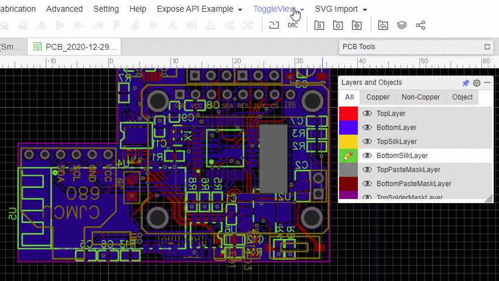

EasyEDA ToggleView Extension
============================
Download [extension.zip from Releases](https://github.com/xsrf/easyeda-toggleview/releases) and extract the files to your disc. Open [EasyEDA](https://easyeda.com/editor), go to "Advanced" > "Extensions" > "Extensions Settings ..." > "Load Extension..." > "Select Files ..." > Select all files from the extracted directory > "Load Extension".

A "ToggleView" Menu should appear in the main menu in PCB view.

Features
--------
Click `ToggleView` to toggle the current PCB editor view between regular and flipped view.

In the `Flip on Layer` menu select the layers which, when activated, should always be flipped automatically. You can always use `ToggleLayer` to override this.

Known Issues
------------
The X ruler is not flipped correctly

How does it work?
-----------------
This is just a hacky workaround until EasyEDA implements it correctly.
It basically applies the style `transform: scaleX(-1)` to the editor to flip it in X direction.
To still be able to interact (click) with the flipped view with your mouse correctly, all mouse events also need to be catched and flipped in x direction.